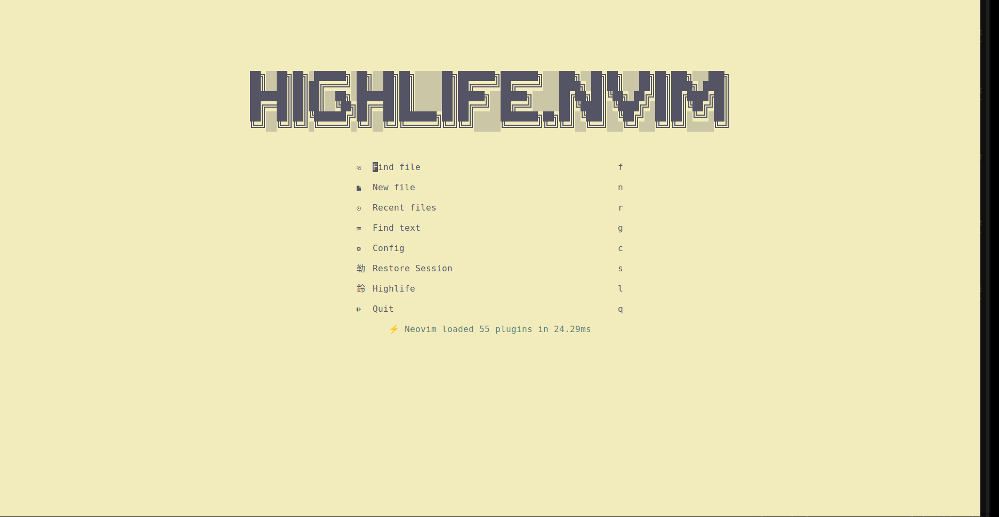
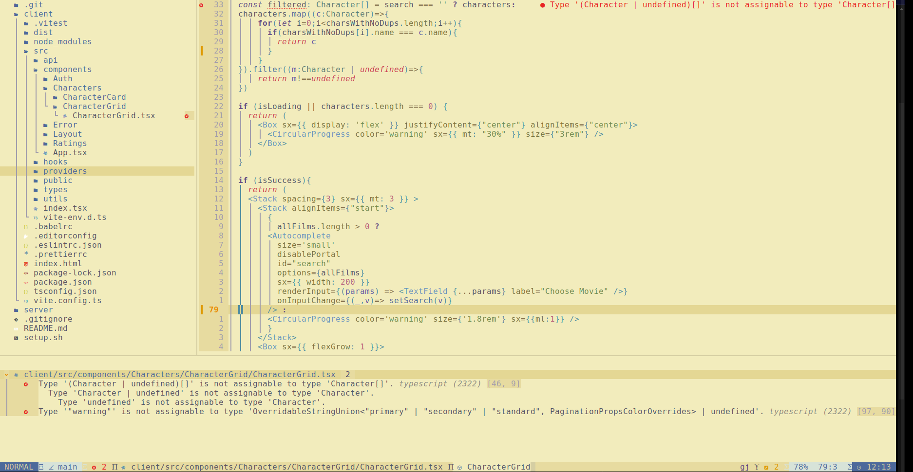

## The Highlife

Sane developers who have a life, usually opt out of intensive configuration and want out of the box toys to play with.<br/>
So this is a luxurious highlife fullstack developement configuration for Neovim that does exactly that.<br/>
<strong>Note</strong>: This is my personal configuration based on other Neovim configurations, you can use it as a template and extend it, or just use it as it is.




## In The Box
### Theme
This configuration will spin the Kanagawa theme by default, but also has Tokyonight installed and configured.<br/>


:

You can change the theme by just typing:
```bash
    :colorscheme <theme variation>
```
<strong>hint</strong>: you can just type :colorscheme and then press tab, and it will suggest the theme names for you.

### And some other stuff
<ul>
<li>LSP: Neovim LSP</li>
<li>Formatter: Null-ls</li>
<li>Autocomplete: CMP</li>
<li>File Browser: Neotree</li>
<li>Syntax Highlight: Treesitter</li>
<li>Diagnostics: Trouble</li>
<li>Notifications: Notify</li>
<li>Package Manager: Mason</li>
<li>Popup Terminal: ToggleTerm</li>
<li>Highlife Dashboard: Alpha</li>
<li>Commandline: Noice</li>
<li>Version Control: Gitsigns</li>
<li>Fuzzy Search: Telescope</li>
</ul>

The whole config is written in lua script, You can extend the configuration by adding files to the plugins folder or editing existing configuration files.
Backup previous configuration then Copy configuration files to: 
  ```
    $HOME/.config/nvim
```


## ⚙ Setup
### Requirements: Git 🔑

Backup your old configuration
```bash
     cp -r $HOME/.config/nvim/ $HOME/.config/nvim.bak/
 ```

  Clone the repository locally
```bash
    git clone  git@github.com:HatemTemimi/highlife.nvim.git $HOME/config/nvim/ 
```

## Snapshots

## Important Credits

Based around [LazyVim](https://github.com/LazyVim/LazyVim) and [Kanagawa Theme](https://github.com/rebelot/kanagawa.nvim).
